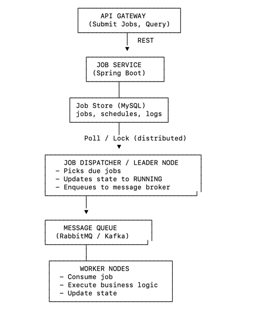
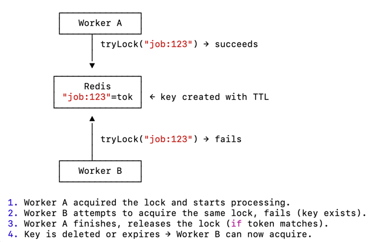

## Distributed Job Scheduler

### A job scheduler is a system that:

•	Accepts jobs (background tasks)
•	Stores them reliably
•	Executes them at the right time (scheduled or immediate)
•	Handles retries, failures, dead workers, and timeouts
•	Runs on multiple nodes (distributed execution)

###  Demonstrates:
✔ Distributed locks
You MUST guarantee that only one node executes a job, even if multiple nodes are running.

Typically done via:
- Redis SETNX
- DB row-level lock (SELECT … FOR UPDATE SKIP LOCKED)

✔ Durable queues
Using:
•	RabbitMQ
•	Kafka
•	Or your own DB table with polling

✔ Retry strategy
Exponential backoff.
Retry count.
Move to DLQ.

✔ Worker architecture
Workers pick jobs, execute them, update state.

✔ Scheduling logic
Cron-like schedules.

✔ Observability
Logs, job metrics, dashboards.

### High-level design:



###  Technologies:
Java 27 | Spring Boot | Spring Data JPA | MySQL | Redis

###  Usage:
1. Define jobs with parameters, schedule, retry policy.


sample job creation API

```json
{
    "name": "test-http",
    "cronExpression": "0 */1 * * * *",
    "handlerType": "http",
    "handlerData": "http://httpbin.org/poster",
    "retryCount": 3,
    "retryBackoffSeconds": 10
}
```
sample run response
```json
{
    "id": 1,
    "name": "test-http",
    "cronExpression": "0 */1 * * * *",
    "handlerType": "http",
    "handlerData": "http://httpbin.org/poster",
    "retryCount": 3,
    "retryBackoffSeconds": 10,
    "createdAt": "2024-06-10T12:00:00",
    "updatedAt": "2024-06-10T12:00:00"
}
```
Sample job run log
```json
{
    "id": 1,
    "jobId": 1,
    "status": "SUCCESS",
    "attempt": 1,
    "output": "{\n  \"args\": {}, \n  \"data\": \"\", \n  \"files\": {}, \n  \"form\": {}, \n  \"headers\": {\n    \"Accept\": \"*/*\", \n    \"Accept-Encoding\": \"gzip, deflate\", \n    \"Host\": \"httpbin.org\", \n    \"User-Agent\": \"Java/1.8.0_292\"\n  }, \n  \"json\": null, \n  \"origin\": \"xx.xx.xx.xx\", \n  \"url\": \"http://httpbin.org/poster\"\n}\n",
    "createdAt": "2024-06-10T12:01:00",
    "updatedAt": "2024-06-10T12:01:00"
}
```